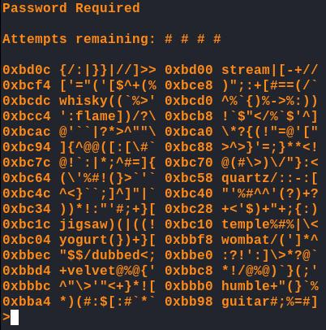
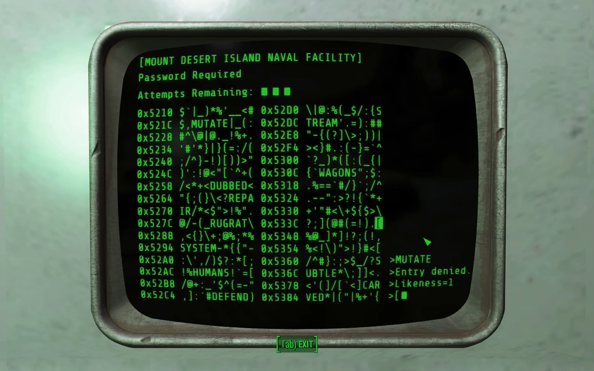

# Fallout hacking minigame
> Recreation of the hacking minigame present in the fallout video game series from part 4 on wards, implemented in Haskell.

Recreation:

Original:

This project was created to learn/practice Haskell.
